  

 

  
  
  
  
  
  

 

  

##  Tech Arsenal

<table align="center">
  <tr>
    <td align="center" width="33%">
      <h4>🧠 AI / LLM Engineering</h4>
      
      
      
      
      
      
      
      
    </td>
    <td align="center" width="33%">
      <h4>📊 Data & Analytics</h4>
      
      
      
      
      
      
      
      
    </td>
    <td align="center" width="33%">
      <h4>☁️ Cloud & Databases</h4>
      
      
      
      
      
      
      
      
    </td>
  </tr>
</table>

  

## 🛰️ Featured Projects

<table align="center">
  <tr>
    <td width="50%" valign="top">
      <h3 align="center">🎓 MOE Advanced Analytics Platform</h3>
      

        
      

      
National-scale education analytics for the Ministry of Education & Science of Mongolia. Real-time Oracle → BigQuery pipeline (GoldenGate + Datastream), Medallion architecture in Dataform, and <b>20 sub-dashboards</b> driving national education policy.

      
<code>BigQuery</code> <code>Datastream</code> <code>Dataform</code> <code>Oracle</code> <code>Tableau</code>

    </td>
    <td width="50%" valign="top">
      <h3 align="center">🤖 AI Engineering @ E-Mongolia</h3>
      

        
      

      
Building LLM-powered systems for Mongolia's national digital-government platform — RAG pipelines, intelligent automation, and multi-agent systems serving government-scale digital services.

      
<code>LangChain</code> <code>LlamaIndex</code> <code>Ollama</code> <code>HuggingFace</code> <code>RAG</code> <code>GCP</code>

    </td>
  </tr>
  <tr>
    <td width="50%" valign="top">
      <h3 align="center">🚨 Fall Detection Model</h3>
      

        
      

      
Real-time fall detection using OpenPose 18-point skeletal keypoints — classifies falls from joint angles and velocity, built for safety monitoring.

      
<code>Deep Learning</code> <code>OpenPose</code> <code>OpenCV</code> <code>Python</code>

    </td>
    <td width="50%" valign="top">
      <h3 align="center">🏠 Apartment Price Prediction</h3>
      

        
      

      
ML model predicting apartment prices with multi-layer perceptrons and gradient boosting, backed by extensive feature engineering.

      
<code>XGBoost</code> <code>MLP</code> <code>Feature Engineering</code> <code>Jupyter</code>

    </td>
  </tr>
</table>

## 📡 GitHub Signals

  
  

  

 

  

   
  <code>◈ 6 languages spoken</code>&nbsp;&nbsp;<code>◆ Math Olympiad Gold</code>&nbsp;&nbsp;<code>◇ Informatics Silver</code>&nbsp;&nbsp;<code>◉ ILWOO Foundation Scholar (1 of 300)</code>
    
  
    
  <code>$ echo "Thanks for stopping by — let's build something cool together."</code>

